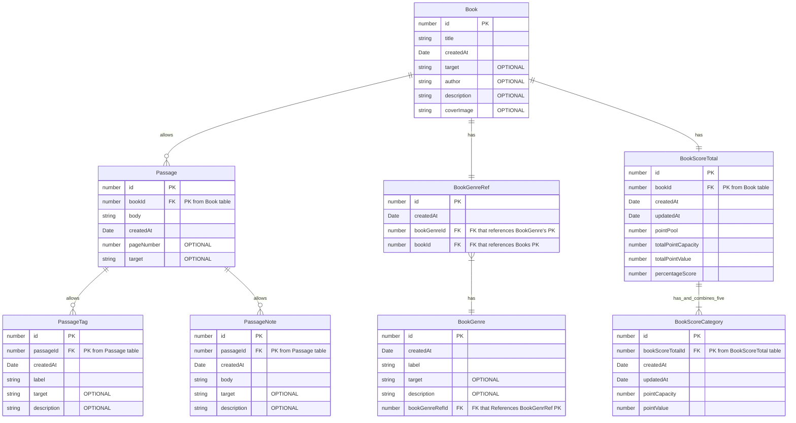

# RiReader
RiReader is an application offered on Web, iOS, and Android, which enables a user to both consume and retain data they've read from a physical book. 

---

## Product Marketing

### Boilerplate Statement
**RiReader** is a neural net powered real-world helper app, designed for fans of physical books 
that want to (1) record key ideas with minimal effort, (2) intuitively understand the content they're reading 
in a way that helps them fine-tune their own thinking framework; and (3) enables a confident understanding of 
what makes a good read "good" through a weighted scoring system that reflects their evolving preferences over time.

### Value Propositions
#### Maximize Reading Flow Efficiency with Effortless Note-Taking
Keep your reading sessions uninterrupted by storing multi-line passages from your favorite books & research papers, captured by 
your smartphone's camera and the power of a neural net OCR engine that's been continuously fine-tuned (under Google's sponsorship) 
for over the past 27 years!

#### Capture Key Ideas Intuitively
Store contextual notes, tags, and details with every book passage you capture, to easily review important ideas 
and refresh each idea's impact on the bigger picture every time you open the app.

#### Think Bigger with Weighted Scoring
Get to know what's important to _you_ with a weighted and flexible book scoring system, covering criteria that includes the author's organization of content, 
their use of examples, and much more. 

---

# Generated Documentation View
This repo generates documentation through a locally run `compodoc` view. To view:
1. Download the repo
2. Run `npm install` to install all dependencies required
3. Run `npm run docs` to both generate documentation from inline comments and serve the documentation site

---

### Feature List
1. Camera to text reader
2. Scoring categories
3. Weighted scoring
4. Graphing tools / visuals for summary metrics
5. Track multiple books concurrently

---

### User Stories
#### V1
1. As a user, I want to **record physical book passages (1 - 5 sentences) from my smartphone's camera to the app**, so that my reading flow isn't disrupted from physical note-taking
2. As a user, I want my recorded book passages to **include their specific page numbers** so that I can refer to passages years into the future
3. As a user, I want to **edit the book passages** that are saved from my smartphone's camera so that I can correct any errors from the OCR engine not identifying lines / blobs correctly
4. As a user, I want to **add contextual notes to any saved book passages I store in the app**, so that I can jog my memory on why it was significant and how I felt about it
5. As a user, I want to **apply overall scores (performance grades) to a book** so that I can more organically understand my own reading preferences and make it so I'm more likely to retain important information
6. As a user, I want to **enable book scoring at any time (during my reading a book AND when it's finished)**, so that I don't lose my train of thought on a book and can read multiple books at once
7. As a user, I want to optionally **record completion progress of a book in a light way** that doesn't force itself into my reading workflow, so that I can prioritize which book to continue reading when I decide it's important
8. As a user, I want to score books based on **10 unique (and app suggested) categories that best reflect my personality and individual preferences** so that I can build an intuitive mental repository of ideas (and the concepts that enabled them)
9. As a user, I want to **change the scoring categories provided by the app (and have additionally suggested categories alongside those completely from scratch)** so that I can explore what metrics make the most sense for my personality or end-goal
10. As a user, I want to **add varied weights to each scoring category** so that I can fine tune which categories are more important to my personal style
11. As a user, I want the **scoring process to feel natural and impermanent** so that it's done often and consistently reminds me what's important to my consumption of material

#### V2+
1. As a user, I want to **change the weighting of scoring categories from book to book** so that I'm able to create a higher level thinking framework during the reading process and retain highly diverse information
2. As a user, I want to **connect ideas from one book passage idea to another book** so that I can begin graphing concepts and ideas from different time periods, disciplines, and industries

---
# Firting with Models

## Entity Relationship Diagram [ERD]

